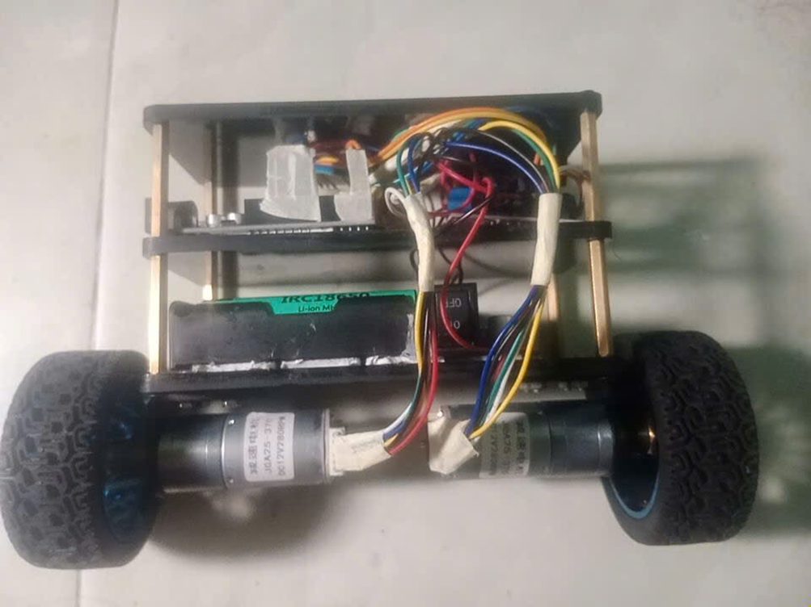

Xe hai bánh tự cân bằng
# Phần cứng:
 + Arduino Uno
 + MPU6050
 + GA25 Encoder
 + Mạch Buck XL4015
 + Pin 18650

Verion 
+ 1.0: Dùng giải thuật PID
+ 1.1: Dùng giải thuật Cadecase PID (2 vòng PID)
+ 2.0 : Dùng Fuzzy kết hợp PID( tự điều chỉnh hệ số PID)

## Kết quả thực tế
+ Phần cứng thực tế:
       

 Link Youtube: https://www.youtube.com/playlist?list=PLvIbYPBREJ7JPMUcFMSeffSnmmATFrFDu

